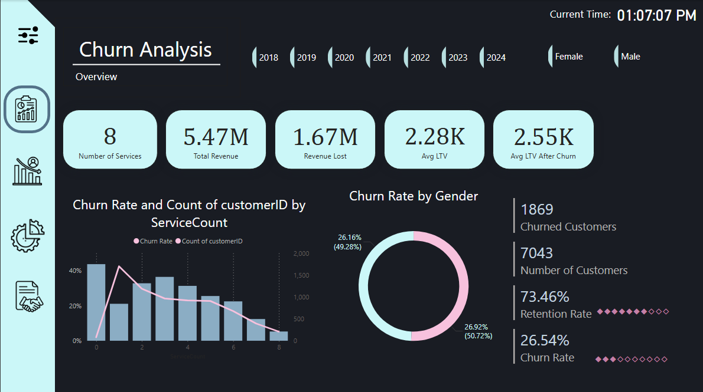

# 📊 Customer Churn Analysis Dashboard

This repository contains a comprehensive **Customer Churn Analysis Dashboard** developed using **Power BI**, focused on analyzing customer attrition trends across multiple dimensions and timeframes. The dashboard enables stakeholders to identify critical churn drivers, segment customers dynamically, and derive strategic insights to improve customer retention.

## 🚀 Key Features

### 🔁 Multi-Year Churn Analysis (2018–2024)
Track churn trends over time with yearly comparisons to monitor performance fluctuations and long-term patterns.

---

### 🎛️ Dynamic Filtering Panel
Interactive filter pane lets users segment data by:
- **Churn Status**
- **Subscription Month**
- **Payment Method**

This flexibility enables tailored views for in-depth exploration.

---

### 📈 Key Performance Indicators (KPIs)
Quick-glance summary of vital metrics:
- **Number of Services**
- **Total Revenue**
- **Revenue Lost**
- **Average Lifetime Value (LTV)**
- **Number of Customers**

---

### 💡 Churn Breakdown by Service Type
Visual comparison of churn across service types:
- **Fiber Optic**
- **DSL**
- **Digital Subscriber Line (DSL)**
Includes further breakdown using `MultipleLines` feature.

---

### 🚻 Churn Rate by Gender
Gender-based churn behavior displayed through a pie chart—facilitating demographic-focused strategies.

---

### 📊 Contract Type vs. Tenure
Bar chart reveals how average customer tenure varies by:
- **Monthly Contracts**
- **1-Year Contracts**
- **2-Year Contracts**

---

### 📉 Customer Count by Service Count
Combined line and bar chart showing:
- Churn rate correlation with number of subscribed services
- Associated customer volume

---

## 💡 Insights Delivered

- 📌 Pinpoints **contract types and service combinations** most vulnerable to churn.
- 💸 Compares **LTV before and after churn**, quantifying financial impact.
- 👥 Highlights **gender-specific churn patterns** to enable targeted marketing.
- 📊 Establishes **retention benchmarks** for long-term performance tracking.

---

## 🛠️ Tools & Technologies Used

- **Power BI** for dashboard creation and interactive visual storytelling
- **DAX** (Data Analysis Expressions) for custom KPIs and calculated columns
- **Bookmarks and slicers** for user-driven filtering and insights

---

## 🧠 Usage

1. Open the `.pbix` file in Power BI Desktop.
2. Use the slicers and bookmarks to explore the data dynamically.
3. Apply filters to test hypotheses about customer behavior and churn patterns.

---

## 📸 Visual Samples

All screenshots shown above are available in the [`screenshots/`](./screenshots) directory for reference or documentation.

---

## 📬 Contact

For questions or suggestions, feel free to reach out via issues or discussions in this repo.

---
